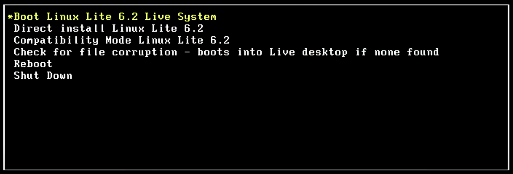
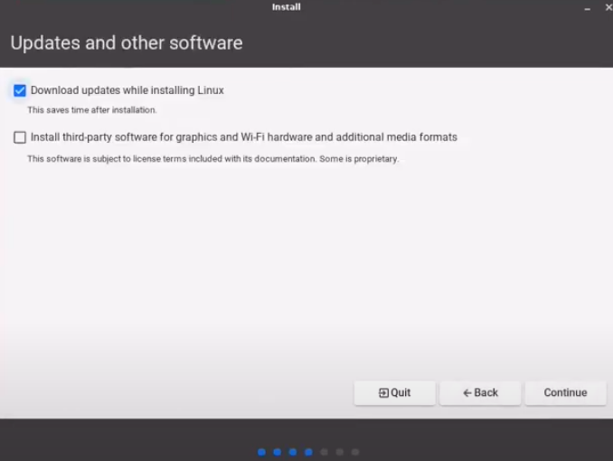
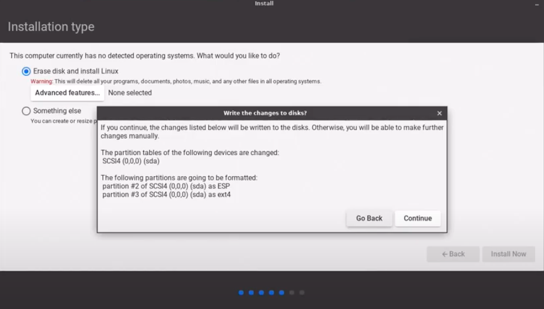
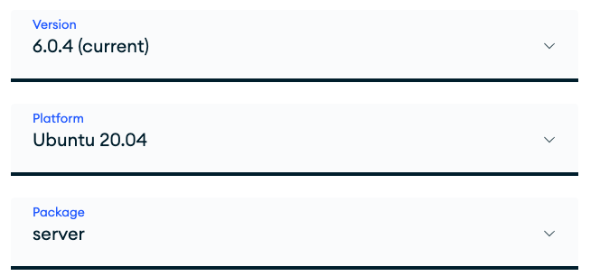

# Installation instructions – Thesis project

Name: William Larsson

## Specifications

This section will present the components and software used.

### Hardware

| Specification       | Description                                         |
| ------------------- | --------------------------------------------------- |
| CPU Type            | AMD E1-2500 APU with Radeon(TM) HD Graphics         |
| CPU Speed           | 1400 MHz                                            |
| HDD Model Name      | Toshiba MQ01ABD050                                  |
| System BIOS Version | V2.02                                               |
| GOP Version         | AMD GOP X64 Driver Rev. 1.45.0.15.31.LibBuiIdNo:216 |
| Serial Number       | NXC2CED03932112F726600                              |
| Product Number      | EasyNote TE69KB                                     |
| Manufacturer Name   | Packard Bell                                        |
| UUID                | AA95EFDF9867459DAC70F016332F0B7C                    |

### OS

| Specification | Description                                         |
| ------------- | --------------------------------------------------- |
| OS            | Linux Lite 6.2                                      |
| Kernel        | Linux 5.15.0.52-generic (x86_64)                    |
| Version       | #58-Ubuntu SMP Thu Oct 13 08:03:55 UTC 2022         |
| C Library     | GNU C Library / (Ubuntu GLIBC 2.35-0ubuntu3.1) 2.35 |

### MongoDB [1]

| Specification | Description              |
| ------------- | ------------------------ |
| Name          | MongoDB Community Server |
| Version       | 6.00.4                   |
| Package       | Server                   |
| Platform      | Ubuntu 20.04             |

### MySQL

| Specification | Description  |
| ------------- | ------------ |
| Name          | MySQL Server |
| Version       | 8.0.32       |
| Platform      | Ubuntu 20.04 |

### Firefox

| Specification | Description  |
| ------------- | ------------ |
| Name          | Firefox      |
| Version       | 110.0        |
| Platform      | Ubuntu 20.04 |

## Installing OS

This section will provide info on how to setup the testing environment.

### Setup Linux Lite

1. Download Linux Lite 6.2 and flash it to a bootable image.
2. When booting up the installation menu, pick the “Boot Linux Lite 6.2 Live System” 
3. Once loaded up, open the “Install Linux Lite” program, and follow instructions.
   1. Check the “Download updates while installing Linux” checkbox
      
   2. Check the “Erase disk and install Linnux” checkbox, then press “Continue”
      
   3. Restart the computer and login

### Setup MongoDB

1. Install the MongoDB community server according to specs in the “specifications” chapter of this document
2. Once installed, run the following commands to fix permission errors
3. `sudo chown -R mongodb:mongodb /var/lib/mongodb`
4. `sudo chown mongodb:mongodb /tmp/mongodb-27017.sock`
5. `sudo service mongod restart`
6. Check if MongoDB is running with `service mongod status`

### Setup MySQL

1. Run the following commands
   1. `sudo apt update `
   2. `sudo apt upgrade`
   3. `sudo apt install mysql-server-8.0=8.0.32.0ubuntu0.22.04.2a`
   4. `sudo service mysql start`

### Check that both services are up


## Using databases

This section will explain how to use to use both databases in Node.js

### MySQL

1. Run the following commands
   1. `sudo mysql –u root `
   2. `CREATE USER 'a20willa'@'localhost' IDENTIFIED BY 'mysql123'`
   3. ```GRANT ALL ON `mysql_database`.* TO 'a20willa'@'localhost';```
   4. `ALTER USER 'a20willa'@'localhost' IDENTIFIED WITH mysql_native_password BY 'mysql123';`
   5. `USE mysql_database`
   6. ```
      CREATE TABLE spatial_data_testing (
        id int primary key
        g geometry
      );
      ```

## Footnotes

[1]


