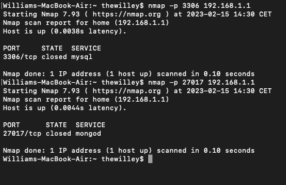

# Installation instructions – Thesis project

Name: William Larsson

## Specifications

This section will present the components and software used.

### Hardware

| Specification       | Description                                         |
| ------------------- | --------------------------------------------------- |
| CPU Type            | Intel(R) Core(TM) i5-7400 CPU @ 3.00GHz             |
| GPU                 | NVIDIA GP106 [GeForce GTX 1060 3GB]                 |
| Memory              | 16 GB 2400 MT/S DDR4                                |

### OS

| Specification | Description                                         |
| ------------- | --------------------------------------------------- |
| OS            | Pop!_OS 22.04 LTS                                   |
| Kernel        | Linux 6.2.6-76060206-generic (x86-64)               |

### MongoDB

| Specification | Description              |
| ------------- | ------------------------ |
| Name          | MongoDB Community Server |
| Version       | 6.0.5                    |
| Package       | Server                   |
| Platform      | Ubuntu 20.04             |

### MySQL

| Specification | Description  |
| ------------- | ------------ |
| Name          | MySQL Server |
| Version       | 8.0.32       |
| Platform      | Ubuntu 20.04 |

### Firefox

| Specification | Description       |
| ------------- | ----------------- |
| Name          | Firefox           |
| Version       | 111.0.1 (64 bit)  |
| Platform      | Ubuntu 20.04      |

### Setup MongoDB

1. Import the MongoDB public GPG key:
   `wget -qO - https://www.mongodb.org/static/pgp/server-6.0.asc | sudo apt-key add -`
2. Create a MongoDB list file:
   `echo "deb [ arch=amd64,arm64 ] https://repo.mongodb.org/apt/ubuntu $(lsb_release -sc)/mongodb-org/6.0 multiverse" | sudo tee /etc/apt/sources.list.d/mongodb-org-6.0.list`
3. Reload the package database:
   `sudo apt-get update`
4. Install MongoDB (6.0.4):
   `sudo apt-get install -y mongodb-org=6.0.4 mongodb-org-database=6.0.4 mongodb-org-server=6.0.4 mongodb-org-mongos=6.0.4 mongodb-org-tools=6.0.4`
5. Once installed, run the following commands to fix permission errors
6. `sudo chown -R mongodb:mongodb /var/lib/mongodb`
7. `sudo chown mongodb:mongodb /tmp/mongodb-27017.sock`
8. `sudo service mongod restart`
9. Check if MongoDB is running with `service mongod status`

### Setup MySQL

1. Run the following commands
   1. `sudo apt update `
   2. `sudo apt upgrade`
   3. `sudo apt install mysql-server-8.0=8.0.32.0ubuntu0.22.04.2a`
   4. `sudo service mysql start`

### Check that both services are up



## Using databases

This section will explain how to use to use both databases in Node.js

### MySQL

1. Run the following commands
   1. `sudo mysql –u root `
   2. `CREATE USER 'a20willa'@'localhost' IDENTIFIED BY 'mysql123'`
   3. `CREATE DATABASE mysql_database`
   4. ```GRANT ALL ON `mysql_database`.* TO 'a20willa'@'localhost';```
   5. `ALTER USER 'a20willa'@'localhost' IDENTIFIED WITH mysql_native_password BY 'mysql123';`

### MongoDB
1. Run the following commands:
   1. `mongosh --host localhost:27017`
   2. `use mongodb_database`
   3. `db.createCollection("spatial_data_testing")`